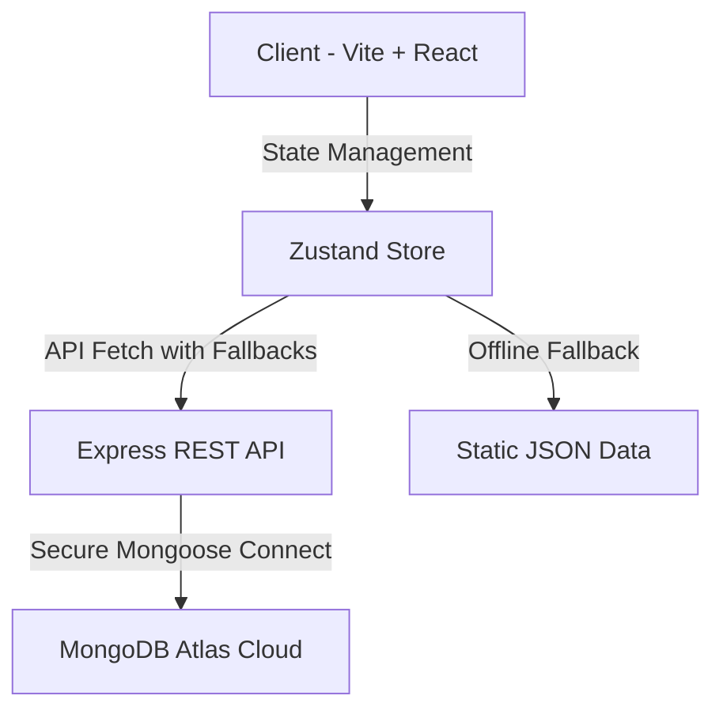

# Cinematic Manga-Inspired DevOps & Cloud Portfolio

A premium, full-stack developer portfolio designed specifically to showcase advanced cloud engineering, CI/CD automation, and modern web application development. The user interface features a custom procedural SVG halftone-noise overlay, responsive manga panel layouts, mouse-tracking 3D-tilt effects, and smooth viewport scroll progress tracking, all built on top of a highly resilient full-stack architecture.

---

## 🛠️ Tech Stack & Architecture



### **Frontend**
*   **Core**: React + Vite (Fast HMR)
*   **Styling**: Vanilla Tailwind CSS + Glassmorphism + Dynamic CSS Keyframe animations.
*   **3D Graphics**: Three.js (Procedural canvas-optimized background starry sky).
*   **Interactions**: Framer Motion (page animations) & calculated 3D perspective mouse tilt hovers.
*   **State Store**: Zustand (Unified dynamic fetching with parallelized `Promise.all` queries and local fallbacks).

### **Backend**
*   **Runtime**: Node.js + Express
*   **Database**: MongoDB Cloud (via Mongoose schemas)
*   **Environments**: Secure isolation via Dotenv `.env` configurations.
*   **API Routing**: Clean division of REST routes for CV profiles, detailed project case studies, and live contact form message telemetry logging.

---

## 🔥 Key Engineering Highlights

### **1. Enterprise-Grade API Fallback**
The portfolio features a bulletproof data layer. The Zustand store asynchronously fetches live data from the Express backend API. If the server is offline or unreachable, the client catches the error and seamlessly falls back to local imports:
```javascript
// Zustand Fetch with Resilient Fallback
try {
  const [profile, projects, skills] = await Promise.all([
    fetch('/api/profile').then(res => res.json()),
    fetch('/api/projects').then(res => res.json()),
    fetch('/api/skills').then(res => res.json())
  ]);
  set({ profile, projects, skills, loading: false });
} catch (error) {
  console.warn("Backend unreachable. Triggering resilient local static data fallbacks.", error);
  set({ profile: localProfile, projects: localProjects, skills: localSkills, loading: false });
}
```

### **2. Dynamic SVG Halftone Manga Overlays**
A worldwide design aesthetic overlay rendering custom procedural SVG turbulence controls to yield a classic physical manga printing halftone screen texture.

### **3. Form Transmission States**
Fully integrated server-side field and email pattern regex validation before hitting the database. The client visualizes each step:
*   `Send Message` (Default state)
*   `Transmitting...` (Disables inputs, spins loading loop)
*   `Transmission Received. ✓` (Delivers checkmark feedback, locks state)
*   `Transmission Failed. Retry?` (Outputs exact server error)

---

## 🚀 Getting Started

Ensure you have [Node.js](https://nodejs.org/) installed locally.

### **1. Clone the Repository**
```bash
git clone https://github.com/krishnalatwal/Portfolio.git
cd Portfolio
```

### **2. Launch the Backend**
```bash
cd backend
npm install
```
Create a `.env` file in `backend/` and configure:
```ini
PORT=5000
MONGODB_URI=mongodb+srv://<username>:<password>@cluster0.xxxx.mongodb.net/portfolio?retryWrites=true&w=majority
```
Start the development server:
```bash
npm run dev
```

### **3. Launch the Frontend**
```bash
cd ../frontend
npm install
npm run dev
```
Open [http://localhost:5173](http://localhost:5173) in your browser.

---

## ☁️ DevOps & Cloud Deployment Roadmap

Designed with structural scalability to facilitate advanced cloud provisioning:
*   **Containerization**: Ready for local deployment using modular `Dockerfile` configurations.
*   **Infrastructure as Code (IaC)**: Structured to allow provisioning of AWS (VPC, EC2, ECS) environments using Terraform.
*   **CI/CD Pipelines**: Easily scalable to support branch preview deployment scripts and automated rollback routines via GitHub Actions.
